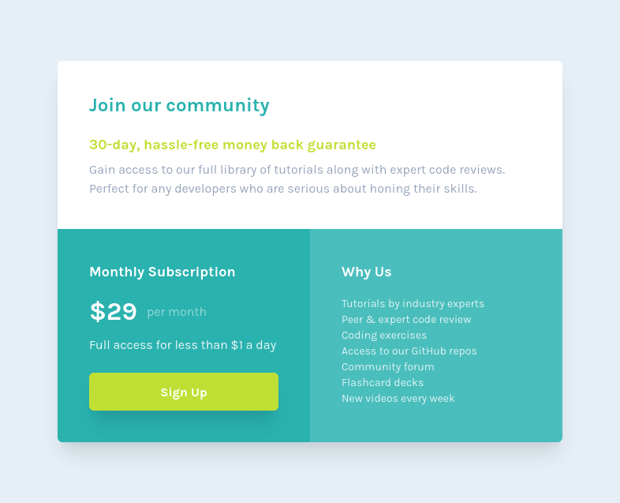

# Frontend Mentor - Single price grid component solution

This is a solution to the [Single price grid component challenge on Frontend Mentor](https://www.frontendmentor.io/challenges/single-price-grid-component-5ce41129d0ff452fec5abbbc). Frontend Mentor challenges help you improve your coding skills by building realistic projects. 

## Table of contents

- [Overview](#overview)
  - [The challenge](#the-challenge)
  - [Screenshot](#screenshot)
  - [Links](#links)
- [My process](#my-process)
  - [Built with](#built-with)
  - [What I learned](#what-i-learned)
  - [Continued development](#continued-development)
  - [Useful resources](#useful-resources)
- [Author](#author)
- [Acknowledgments](#acknowledgments)

**Note: Delete this note and update the table of contents based on what sections you keep.**

## Overview

### The challenge

Users should be able to:

- View the optimal layout for the component depending on their device's screen size
- See a hover state on desktop for the Sign Up call-to-action

### Screenshot



### Links

- Solution URL: [Add solution URL here](https://github.com/jp-roland/single-price-grid-component)
- Live Site URL: [Add live site URL here](https://single-price-grid-component-seven-xi.vercel.app/)

## My process

### Built with

- Desktop-first workflow
- [React](https://reactjs.org/) - JS library
- [Tailwind CSS](https://tailwindcss.com/) - For styles

### What I learned

- How to make Tailwind CSS work in a Create React App application.
- How to apply the necessary styles using Tailwind CSS.
- That a property can be applied multiple times to the same component as long as they are defined in different breakpoints.

```html
<div className="bg-white p-6 sm:p-10 rounded-t-md">
```

- How to deploy the application to Vercel.

### Continued development

Next step is to research about Next.js and whether it would be useful provided my end goal of deploying an application to AWS.
I still have to figure out how to make smooth shadows around the borders. I still can see a right angle with the original background colour.

### Useful resources

- [Tailwind CSS Play](https://play.tailwindcss.com/) - This helped understand Tailwind CSS enough to complete the challenge.

## Author

- Frontend Mentor - [@jp-roland](https://www.frontendmentor.io/profile/jp-roland)

## Acknowledgments

I was inspired to finally learn frontend development by watching Jessica Chan's videos on Youtube (https://www.youtube.com/c/TheCoderCoder).